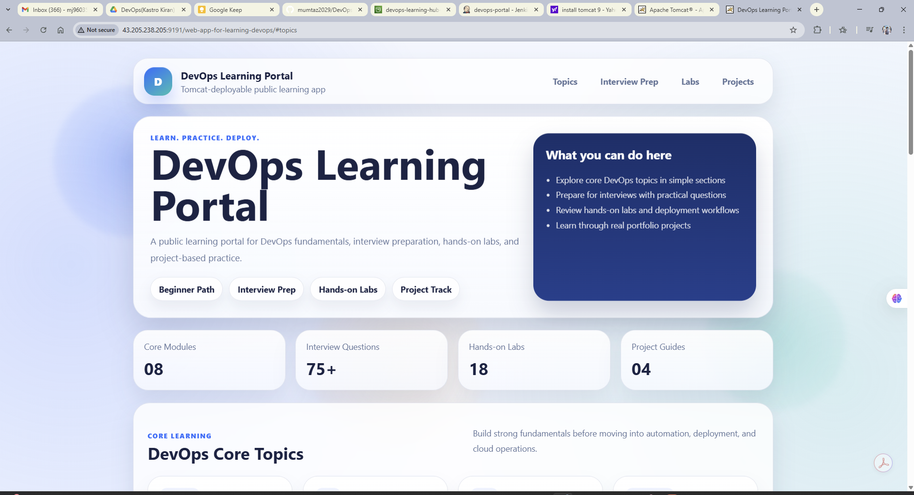
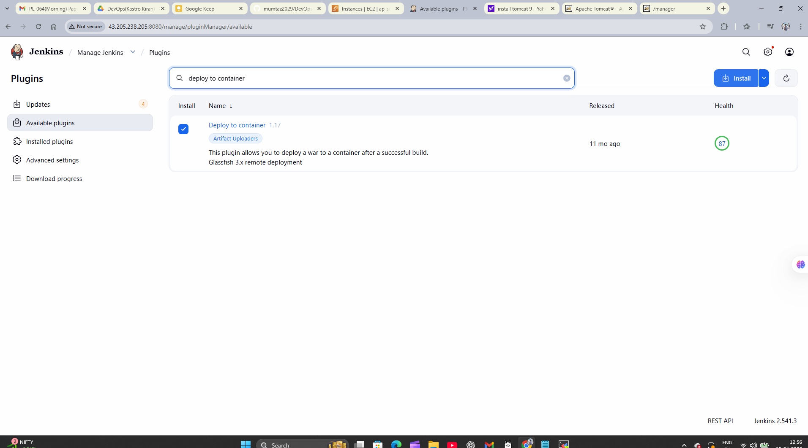
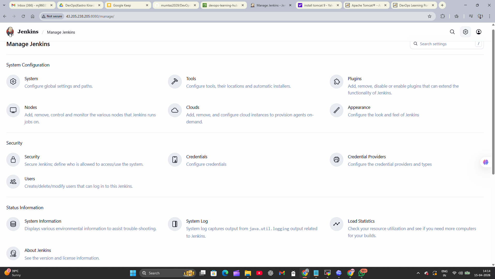
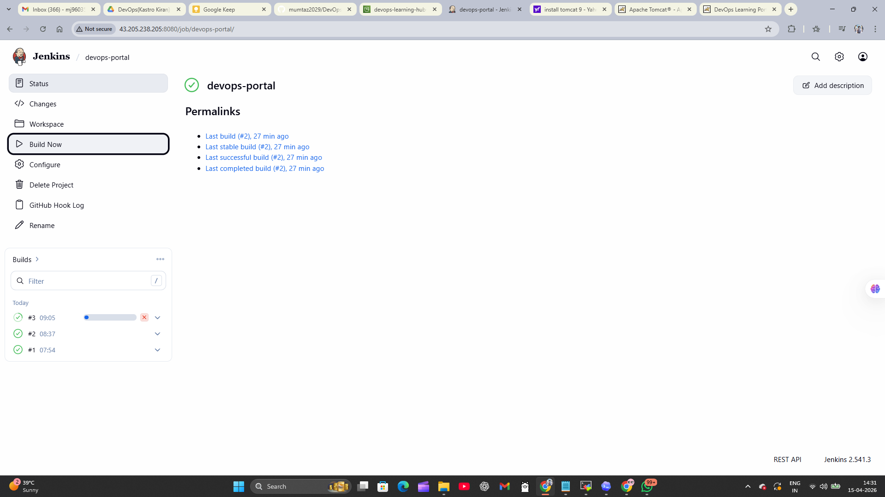

# Project 4 - DevOps Learning Portal

This project is a Maven-based Spring Boot application packaged as a `.war` file so it can be deployed to an external Apache Tomcat server.

It now presents a modern DevOps Learning Portal with topic-wise learning sections, interview preparation, hands-on labs, project-based learning, and public-facing revision resources, while still keeping the WAR deployment flow for Apache Tomcat on Amazon Linux EC2.

## Tech Stack

- Java 17
- Maven
- Spring Boot 2.7
- Apache Tomcat 9
- Thymeleaf
- Amazon Linux EC2

## Project Goal

This repository is meant to demonstrate:

- WAR artifact creation with Maven
- Deployment to external Tomcat instead of embedded Tomcat
- A public-facing DevOps learning platform built with Spring Boot and Thymeleaf
- EC2-friendly deployment steps for a DevOps portfolio project

## Portal Sections

- Core DevOps topics
- Interview preparation
- Hands-on labs
- Project-based learning
- Revision resources and roadmaps

## Visual Walkthrough

These screenshots show both the public-facing learning portal and the Jenkins-based CI/CD flow used to build, store, and deploy the WAR artifact.

### Live DevOps Learning Portal



### Jenkins Plugin Installation

This step shows the `Deploy to container` plugin being prepared for Tomcat deployment.



### Jenkins S3 Artifact Publishing

This screenshot shows the post-build configuration used to publish the generated WAR artifact to S3.



### Jenkins Build Verification

This view confirms successful job execution and helps demonstrate the CI/CD flow clearly in the repository.



## Build The WAR

Run this inside the project directory:

```bash
mvn clean package
```

Expected artifact:

```bash
target/project4-devops-app.war
```

## Local Run Option

Even though this project is prepared for external Tomcat deployment, it still includes a `main` method. You can run it locally for testing if needed:

```bash
mvn spring-boot:run
```

## Deploy On Amazon Linux EC2

These steps assume:

- You created an EC2 instance
- You installed Java 17
- You installed Maven
- You installed Apache Tomcat 9
- Port `9191` is allowed in the EC2 security group if Tomcat is moved away from `8080`

### 1. Install dependencies

Amazon Linux 2023 example:

```bash
sudo dnf update -y
sudo dnf install -y java-17-amazon-corretto-devel git maven tar
```

### 2. Install Tomcat 9

```bash
cd /opt
sudo curl -O https://downloads.apache.org/tomcat/tomcat-9/v9.0.117/bin/apache-tomcat-9.0.117.tar.gz
sudo tar -xzf apache-tomcat-9.0.117.tar.gz
sudo mv apache-tomcat-9.0.117 tomcat
sudo chmod +x /opt/tomcat/bin/*.sh
```

### 3. Download the repository

```bash
git clone https://github.com/mumtaz2029/DevOps-Learning-Hub-.git
cd Project--4
```

If you prefer ZIP download:

- Download the ZIP from GitHub
- Unzip it on the EC2 instance
- Open the extracted project directory

### 4. Build the WAR file

```bash
mvn clean package
```

### 5. Copy the WAR to Tomcat

```bash
sudo cp target/project4-devops-app.war /opt/tomcat/webapps/
```

### 6. Start Tomcat

```bash
sudo /opt/tomcat/bin/startup.sh
```

### 7. Open the application

```text
http://<your-ec2-public-ip>:9191/project4-devops-app/
```

## Application Endpoints

- Home page: `/project4-devops-app/`
- Health endpoint: `/project4-devops-app/api/health`

## Deployment Options

This repository supports three simple deployment flows depending on how you want to use Tomcat.

### Option 1. Download ZIP From GitHub And Upload The WAR

This is the easiest option for someone who just wants a ready WAR file from the repository.

1. Open the repository on GitHub.
2. Click `Code` and download the ZIP file.
3. Unzip the downloaded file on your machine or server.
4. Open the `deployable/` folder.
5. Use the WAR file named `project4-devops-app.war`.

If you are using Tomcat Manager:

1. Open the Tomcat Manager page.
2. In the `WAR file to deploy` section, click `Choose File`.
3. Select `deployable/project4-devops-app.war`.
4. Click `Deploy`.

### Option 2. Deploy Using Tomcat Manager Upload

If you want to build the WAR yourself and then upload it in the Tomcat web interface:

```bash
git clone https://github.com/mumtaz2029/DevOps-Learning-Hub-.git
cd Project--4
mvn clean package
```

After the build finishes:

1. Open Tomcat Manager.
2. In the `WAR file to deploy` section, click `Choose File`.
3. Select `target/project4-devops-app.war`.
4. Click `Deploy`.

### Option 3. Copy The WAR Into The Tomcat webapps Folder

If you want to deploy directly on the server without using the Tomcat Manager page:

```bash
git clone https://github.com/mumtaz2029/DevOps-Learning-Hub-.git
cd Project--4
mvn clean package
sudo cp target/project4-devops-app.war /path/to/tomcat/webapps/
```

Then restart Tomcat.

Example:

```bash
sudo /path/to/tomcat/bin/shutdown.sh
sudo /path/to/tomcat/bin/startup.sh
```

If your Tomcat is installed in a custom location, replace `/path/to/tomcat/` with your real path.

## Jenkins CI/CD Deployment On EC2

This project can also be deployed through a Jenkins freestyle job using Maven for build and Tomcat 9 for deployment. In this setup, build artifacts can also be stored in an AWS S3 bucket so they are preserved outside the EC2 instance.

### Deployment Flow

1. Launch an Amazon Linux EC2 instance.
2. Connect to the server using MobaXterm.
3. Install Java 17, Maven, Git, Jenkins, and Tomcat 9.
4. Change the Tomcat port in `server.xml` to avoid conflict with Jenkins.
5. Open the Tomcat port in the EC2 security group.
6. Create an S3 bucket to store generated build artifacts.
7. Create an IAM role with S3 access and attach it to the EC2 instance so Jenkins can communicate with S3 securely.
8. Configure Tomcat Manager access and create Tomcat admin credentials.
9. Configure GitHub and Tomcat credentials in Jenkins.
10. Create a Jenkins job to pull the repository, build the WAR, publish the artifact to S3, and deploy it to Tomcat.

### Server Setup

Install required packages:

```bash
sudo dnf update -y
sudo dnf install -y java-17-amazon-corretto-devel git maven
```

Install and start Jenkins:

```bash
sudo systemctl enable jenkins
sudo systemctl start jenkins
sudo systemctl status jenkins
```

Tomcat can be installed manually and configured on a custom port such as `9191` so that Jenkins can continue using `8080`.

### Store Artifacts In AWS S3

To keep generated WAR files in AWS cloud storage, create an S3 bucket for your build artifacts.

Example flow:

1. Create an S3 bucket such as `devops-learning-hub-artifacts`
2. Create an IAM role for EC2
3. Attach a policy that allows S3 access
4. Attach the IAM role to the EC2 instance

This is important because the EC2 instance should not rely on hardcoded AWS credentials. By attaching an IAM role, Jenkins running on EC2 can securely upload and access artifacts in S3.

For practice environments, you may use `AmazonS3FullAccess`. For better real-world security, a narrower bucket-specific policy is recommended.

Once the role is attached, the EC2 instance can interact with S3 using AWS CLI or Jenkins build steps without storing AWS access keys manually.

### Tomcat Configuration

Update the connector port in `server.xml`:

```xml
<Connector port="9191" protocol="HTTP/1.1"
```

Edit these files to allow Tomcat Manager access:

- `webapps/manager/META-INF/context.xml`
- `webapps/host-manager/META-INF/context.xml`

Edit `tomcat-users.xml` and add roles such as:

```xml
<role rolename="manager-gui"/>
<role rolename="manager-script"/>
<role rolename="admin-gui"/>
<user username="admin" password="your-password" roles="manager-gui,manager-script,admin-gui"/>
```

The `manager-script` role is important for Jenkins deployment.

### Jenkins Configuration

In Jenkins:

- Install the `Deploy to container` plugin
- Install the `S3 publisher` plugin
- Configure JDK under `Manage Jenkins` -> `Tools`
- Add GitHub credentials for the repository
- Add Tomcat credentials matching the user in `tomcat-users.xml`

### Configure S3 In Jenkins

After the EC2 IAM role is attached, Jenkins can use the instance role to upload artifacts to S3 without storing AWS access keys manually.

Recommended setup:

1. Open Jenkins
2. Go to `Manage Jenkins` -> `Plugins`
3. In `Available plugins`, search for `S3 publisher`
4. Install the plugin and restart Jenkins if required
5. Open your freestyle job and click `Configure`
6. Keep your Git and Maven build steps as usual
7. Under `Post-build Actions`, click `Add post-build action`
8. Select `Publish artifacts to S3 Bucket`

Suggested field values:

- `Bucket`: your S3 bucket name
- `Region`: your AWS bucket region such as `ap-south-1`
- `Source files`: `**/*.war`
- `No upload on build failure`: enabled
- `Flatten files`: optional
- `Server-side encryption`: optional but recommended

This step uploads the generated WAR artifact to S3 after the build completes successfully.

### Jenkins Job Setup

Create a freestyle project and configure:

- Source Code Management: `Git`
- Repository URL: your GitHub repository URL
- Credentials: GitHub credentials
- Branch: `*/main`

Under `Build`:

- Select `Invoke top-level Maven targets`
- Goals:

```text
clean package
```

Under `Post-build Actions`:

- First select `Publish artifacts to S3 Bucket`
- Bucket: your S3 bucket name
- Region: your AWS region
- Source files:

```text
**/*.war
```

- Then add another post-build action
- Select `Deploy war/ear to a container`
- WAR/EAR files:

```text
**/*.war
```

- Container: `Tomcat 9.x Remote`
- Tomcat URL:

```text
http://<your-ec2-public-ip>:9191
```

- Credentials: Tomcat credentials

### Build And Verify

Click `Build Now` in Jenkins.

The expected sequence is:

1. Jenkins pulls the code from GitHub
2. Maven runs `clean package`
3. The WAR file is generated
4. Jenkins uploads the WAR to S3
5. Jenkins deploys the WAR to Tomcat 9

If the build, artifact upload, and deployment succeed, open:

```text
http://<your-ec2-public-ip>:9191/project4-devops-app/
```

This deployment flow demonstrates:

- GitHub integration with Jenkins
- Maven build automation
- Artifact storage in AWS S3
- WAR artifact generation
- Remote deployment to Tomcat 9
- IAM role-based secure AWS access from EC2
- End-to-end CI/CD for a Java web application

## Important Compatibility Note

This project now uses Spring Boot 2.7 so it is compatible with:

- Apache Tomcat 9

This is a better fit for environments where Tomcat 9 is already installed and you want a straightforward WAR deployment flow.

## Optional Restart Command

If you replace the WAR after the first deployment, restart Tomcat:

```bash
sudo pkill -f tomcat || true
sudo /opt/tomcat/bin/startup.sh
```

## Helper Script

A helper deployment script is included:

```bash
scripts/deploy-war.sh
```

Before using it, make sure:

- Tomcat is installed at `/opt/tomcat`
- Maven is installed
- The script has execute permission

Example:

```bash
chmod +x scripts/deploy-war.sh
./scripts/deploy-war.sh
```
